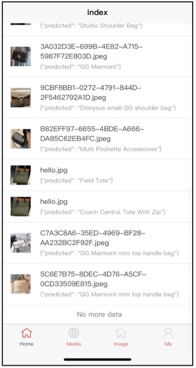

# Distributed Bag Detection AI System

​	Our project is an object detection application based on **Region-based Convolutional Neural Networks (R-CNN)** algorithm. The current focus of detection is on Bags.

## Summary

- [Technique](##Technique)

- [Result Achieved](##Result Achieved)

- [Preview](##Preview)

## Technique

### Model Training

- Python
- Kaggle
- Beautiful Soup, Selenium, ChromeDriver
- R-CNN
- ResNet-152
  - 88.09% accuracy

### Application Development

#### Front End

- Vue Script Language
  - uni-app front-end framework 

#### Back End

- Java
- Python
- Flask framework
- Maven
- Spring Cloud (Eureka, Gateway)
- Spring Boot
- Mybatis
- Nginx
- FastDFS
- Databases
  - MongoDB
  - MySQL
  - Redis
- Hypertext Transfer Protocol (HTTP)

## Result Achieved

1) Login & Register (in Mobile App). Record the number of logins in a year.

2) Upload images by taking photos or from photo libraries or computers and store information of users and images into our databases.

3) Through fastDFS distributed file system, store uploaded images into storage server. Return and store the path where the file is stored. 

4) Our model can predict the name of the bag inside images.

5) Users can see their image searching history including the predicted results. Nginx processes users’ requests for getting images.

6) In web app, users can crop, zoom in, zoom out, and rotate images.

7) Master-slave-replication

## Preview

### Mobile App

**login:**

**Select a photo:**

**Predict result:**

**Searching history:**

### Website App

**Login:**

**Select an image:**

**Upload the image:**

**Preview cropped image:**

**Get the prediction:**

**Display searching history:**

